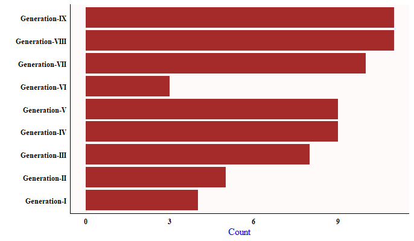
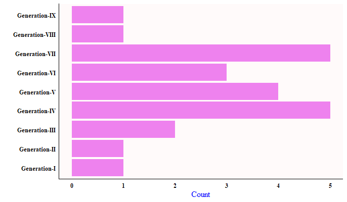

```{r setup, include=FALSE}
knitr::opts_chunk$set(
	echo = FALSE,
	message = FALSE,
	warning = FALSE
)
library(knitr)
library(reticulate)
```

## <br><br>Introduction

<br> The world of pokemon! The world that is filled with these creatures known as pokemon, from small and cute to huge and deadly, there is no end to variety when it comes to these creatures in this world. However, even in this world, the legendary and mythical pokemon hold a special status. Worshiped as gods, feared as destructive forces, revered as deities and guardians, these mighty creatures posses an enormous amount of strength and unique abilities. However, these pokemon are special not only in their abilities but also in numbers, for how few of them there are! So few that it is a grey area for even Professor Samuel Oak, the leading figure when it comes to pokemon research. Remember the goosebumps when you caught your first such pokemon or the feeling of how special an anime episode felt when one of these made an appearance? Yeah that rare! So what's so special about them? What makes these creatures so special? Let's dive right in and find out!. <br><br>

```{r, echo = FALSE, results = 'asis'}

Legendary <- "Plots/Legendary.png"
Mythical <- "Plots/Mythical.png"

cat('<div style="display: flex; align-items: flex-start;">')
cat(paste0(''))
cat(paste0(''))
cat('</div>')
```

## <br><br>Count

<br> Okay, so let's get started and first we will take a look at the number of pokemon for each category. <br>

```{r echo=FALSE, message=FALSE, warning=FALSE, paged.print=FALSE}
source("Analysis_Wrangling.R")

print(pokedex_leg)
print(pokedex_myt)
```

<br> As we can look there are 70 legendary pokemon to date but only 29 mythical ones. But it's okay considering the fact that mythical pokemon are supposedly rarer of the two and were introduced later. <br>

## Battle Statistics

<br> As we all know from our experiences in Pokemon, be it the games or the anime, these Pokemons were extraordinarily strong and most difficult to beat. They were treated as gods, deities and guardians after all. <br>


<br> And true to their name, the legendary pokemons live up to the hype with most of them ranging around 600 and a fair few also nearing or crossing the 700 mark. One curious point is the five pokemon in below which have lower stats but all of them are from the newer generations where the new concept of evolving legendary pokemons was introduced and a few of them like Cosmog and Kubfu are those early stages of a legendary pokemon.<br>


<br> The distribution is much uniform when it comes to the mythical 'mons with most being in the 600 range, or exact 600 to be accurate. The effect of evolving mythical pokemons can be seen here as well, in the form of Meltan and Phione. The highest one above all else is of course Arcues. Well, not for nothing is he the god of the pokemon world. <br>

 <br><br>

## Height and Weight

<br> As shown in the below plot, it's clear that most of the legendary pokemon are tall heavyweights with there being two outliers. One is Cosmoem which is tiny in size but weights like the universe itself! The other one is Gen 8's Eternatus, which is an outlier to the very idea of a pokemon in itself, and has extremely high height and weight.<br>


<br> On the other hand, the mythical pokemon are much lighter and less taller as well (not to mention much cuter). The one exception to their weight is Gen 7's Steel Freak Melmetal, which weighs close to 8000 kilograms! <br>

 <br><br>

## Generation

<br> Looking at the number of legendary pokemon released in each generation over the years it's obvious that the number of legendary pokemon has been increasing with each generation, which is quite predictable. Gen-6 might seem like the outlier but that was the year when least pokemon were released so it's lack of legendary pokemon is understandable. <br>



<br> However, there is no such pattern when it comes to mythical 'mon with the franchise releasing only one mythical pokemon each over the last two gens (Seriously?)! The lack of mythical pokemon in the earlier gens or even overall as they were introduced as "rare" pokemon but maybe releasing only one each generation takes them more towards extinct and less towards rare (note that Game Freak!). <br>

 <br><br>

## Types

<br> Below we can see that the psychic type a counts for the most number of pokemon in both the legendary and mythical categories. A high number of legendary pokemon are dragon type which makes sense as they are always so strong. One key point to notice is that though the flying type accounts for many legendary pokemon, almost all of them have had it as a secondary typing(all except Tornadus), which happens when there is no secondary typing available for the pokemon and the creators want it to have one. I mean, many of the pokemon can fly but don't have a flying type (see Giratina, Dialga, Palkia), so it doesn't makes much sense. And no such love for flying type is shown for the mythical pokemon, which don't have a single flying type 'mon in their ranks. But again, when it comes to the flying type, not much makes sense. <br>


 <br><br>

## Predicting the status

<br> Finally, I have built a classification model which classifies the pokemon as legendary, mythical and ordinary (in case they are classified as neither legendary not mythical). The model uses a random forest algorithm to make its predictions. It takes the battle statistics of the pokemon and their dimensions as feature inputs and performs the multi-class classification.

<br> The random forest algorithm takes optimal values for number of estimators and criterion as 63 and gini, which values were determined using grid search algorithm. <br>

```{python echo=FALSE}
# Importing the libraries

import numpy as np
import matplotlib.pyplot as plt
import pandas as pd
from sklearn.model_selection import train_test_split
from sklearn.preprocessing import StandardScaler
from sklearn.preprocessing import LabelEncoder
from sklearn.ensemble import RandomForestClassifier
from sklearn.metrics import accuracy_score
from sklearn.model_selection import GridSearchCV

# Importing the dataset

pokedex = pd.read_csv('Pokedex.csv')
X = pokedex.iloc[:, 8:17].values
y = pokedex.iloc[:, -1].values

label_encoder = LabelEncoder()
y = label_encoder.fit_transform(y)

# Splitting the dataset into the Training set and Test set

X_train, X_test, y_train, y_test = train_test_split(X, y, test_size = 0.2, random_state = 0)

# Feature Scaling

sc = StandardScaler()
X_train = sc.fit_transform(X_train)
X_test = sc.transform(X_test)

# Creating the Random Forest Classifier

RFC = RandomForestClassifier(n_estimators = 63, criterion = 'gini', random_state = 0)
RFC = RFC.fit(X_train, y_train)

# Applying grid search

parameters = [{'n_estimators': range(1, 200), 'criterion': ['entropy']},
              {'n_estimators': range(1, 200), 'criterion': ['gini']}]
grid_search = GridSearchCV(estimator = RFC,
                           param_grid = parameters,
                           scoring = 'accuracy',
                           cv = 10,
                           n_jobs = -1)
grid_search = grid_search.fit(X_train, y_train)
best_parameters = grid_search.best_params_
print(f"Best Values for Parameters: {best_parameters}")
```

<br> It has a accuracy score of 96.34% and standard variation of 1.34% validated 10 times using k-fold cross validation. <br>

```{python echo=FALSE}
from sklearn.model_selection import cross_val_score

accuracies = cross_val_score(estimator = RFC, X = X_train, y = y_train, cv = 10)
print(f"Average Accuracy: {accuracies.mean()*100: .2f}%")
print(f"Standard Deviation of Accuracy: {accuracies.std()*100: .2f}%")
```

<br> The model narrowly outperforms the XGBoost classification model built for the same task. <br>

 <br>

## Variable Importance

<br> At last, we'll look at the features that contributed the most to our random forest model as it is also interesting to know which variable is contributing how much to the model. For this purpose, we'll use the two measures of variable importance returned by a random forest algorithm: MeanDecreaseAccuracy and MiniDecreaseGini. <br>

```{python echo=FALSE, message=FALSE}

from sklearn.inspection import permutation_importance

result = permutation_importance(RFC, X_test, y_test, n_repeats = 10,
                                random_state = 0, n_jobs = -1)
importance_df = pd.DataFrame({'Feature': pokedex.columns[8:17], 'MeanDecreaseAccuracy': result.importances_mean,
                              'MeanDecreaseGini': RFC.feature_importances_})
print(importance_df)
```

## <br>Conclusion

<br> It was a lot of fun doing this project and getting to know more and more about the pokemon that we all love so much. Thanks for reading this and hope that this was a joyful and nostalgic ride for you as well. Sadly, that's all there is about the legendary and mythical pokemon and I'll have to sign off now. Hope we meet again on another such topic sometime soon. Until then, *Gotta Catch 'Em All!*
