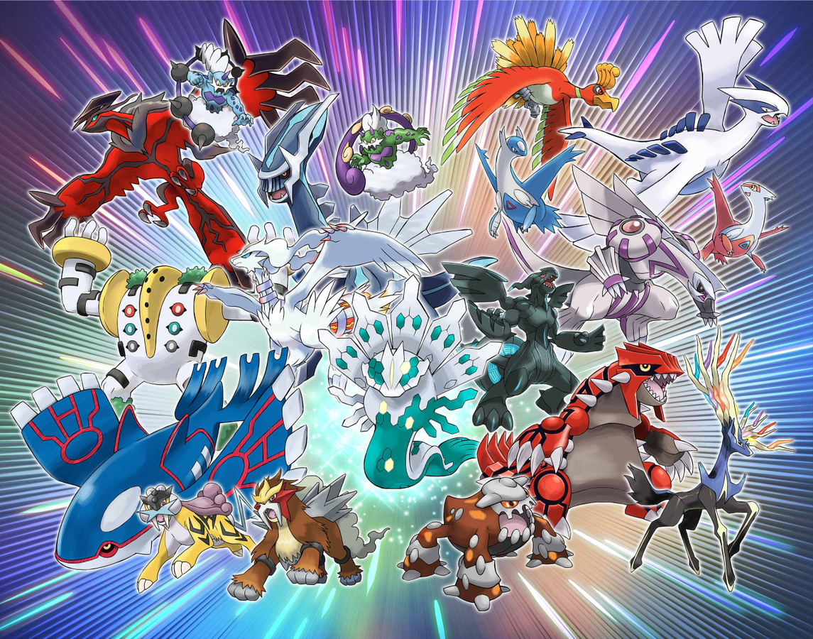
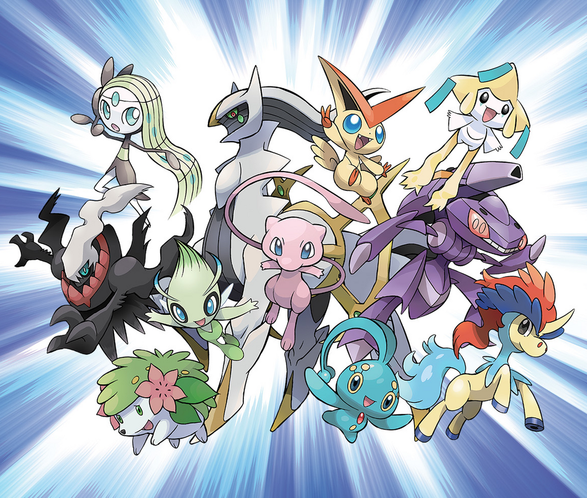

What makes a pokemon special
================

##   Introduction

  The world of pokemon! The world that is filled with these creatures
known as pokemon, from small and cute to huge and deadly, there is no
end to variety when it comes to these creatures in this world. However,
even in this world, the legendary and mythical pokemon hold a special
status. Worshiped as gods, feared as destructive forces, revered as
deities and guardians, these mighty creatures posses an enormous amount
of strength and unique abilities. However, these pokemon are special not
only in their abilities but also in numbers, for how few of them there
are! So few that it is a grey area for even Professor Samuel Oak, the
leading figure when it comes to pokemon research. Remember the
goosebumps when you caught your first such pokemon or the feeling of how
special an anime episode felt when one of these made an appearance? Yeah
that rare! So what’s so special about them? What makes these creatures
so special? Let’s dive right in and find out!.   

##   Count

  Okay, so let’s get started and first we will take a look at the
number of pokemon for each category.  

    ## # A tibble: 70 × 15
    ##    index name   generation type1 type2 total    hp   atk   def spatk spdef speed
    ##    <dbl> <chr>  <fct>      <chr> <chr> <dbl> <dbl> <dbl> <dbl> <dbl> <dbl> <dbl>
    ##  1   144 Artic… Generatio… Ice   Flyi…   580    90    85   100    95   125    85
    ##  2   145 Zapdos Generatio… Elec… Flyi…   580    90    90    85   125    90   100
    ##  3   146 Moltr… Generatio… Fire  Flyi…   580    90   100    90   125    85    90
    ##  4   150 Mewtwo Generatio… Psyc… None    680   106   110    90   154    90   130
    ##  5   243 Raikou Generatio… Elec… None    580    90    85    75   115   100   115
    ##  6   244 Entei  Generatio… Fire  None    580   115   115    85    90    75   100
    ##  7   245 Suicu… Generatio… Water None    580   100    75   115    90   115    85
    ##  8   249 Lugia  Generatio… Psyc… Flyi…   680   106    90   130    90   154   110
    ##  9   250 Ho-Oh  Generatio… Fire  Flyi…   680   106   130    90   110   154    90
    ## 10   377 Regir… Generatio… Rock  None    580    80   100   200    50   100    50
    ## # ℹ 60 more rows
    ## # ℹ 3 more variables: height <dbl>, weight <dbl>, rank <chr>

    ## # A tibble: 23 × 15
    ##    index name   generation type1 type2 total    hp   atk   def spatk spdef speed
    ##    <dbl> <chr>  <fct>      <chr> <chr> <dbl> <dbl> <dbl> <dbl> <dbl> <dbl> <dbl>
    ##  1   151 Mew    Generatio… Psyc… None    600   100   100   100   100   100   100
    ##  2   251 Celebi Generatio… Psyc… Grass   600   100   100   100   100   100   100
    ##  3   385 Jirac… Generatio… Steel Psyc…   600   100   100   100   100   100   100
    ##  4   386 Deoxys Generatio… Psyc… None    600    50   150    50   150    50   150
    ##  5   489 Phione Generatio… Water None    480    80    80    80    80    80    80
    ##  6   490 Manap… Generatio… Water None    600   100   100   100   100   100   100
    ##  7   491 Darkr… Generatio… Dark  None    600    70    90    90   135    90   125
    ##  8   492 Shaym… Generatio… Grass None    600   100   100   100   100   100   100
    ##  9   493 Arceus Generatio… Norm… None    720   120   120   120   120   120   120
    ## 10   494 Victi… Generatio… Psyc… Fire    600   100   100   100   100   100   100
    ## # ℹ 13 more rows
    ## # ℹ 3 more variables: height <dbl>, weight <dbl>, rank <chr>

  As we can look there are 70 legendary pokemon to date but only 29
mythical ones. But it’s okay considering the fact that mythical pokemon
are supposedly rarer of the two and were introduced later.  

## Battle Statistics

  As we all know from our experiences in Pokemon, be it the games or
the anime, these Pokemons were extraordinarily strong and most difficult
to beat. They were treated as gods, deities and guardians after all.
 

  And true to their name, the legendary pokemons live up to the hype
with most of them ranging around 600 and a fair few also nearing or
crossing the 700 mark. One curious point is the five pokemon in below
which have lower stats but all of them are from the newer generations
where the new concept of evolving legendary pokemons was introduced and
a few of them like Cosmog and Kubfu are those early stages of a
legendary pokemon. 

  The distribution is much uniform when it comes to the mythical
’mons with most being in the 600 range, or exact 600 to be accurate. The
effect of evolving mythical pokemons can be seen here as well, in the
form of Meltan and Phione. The highest one above all else is of course
Arcues. Well, not for nothing is he the god of the pokemon world.  

   

## Height and Weight

  As shown in the below plot, it’s clear that most of the legendary
pokemon are tall heavyweights with there being two outliers. One is
Cosmoem which is tiny in size but weights like the universe itself! The
other one is Gen 8’s Eternatus, which is an outlier to the very idea of
a pokemon in itself, and has extremely high height and weight. 

  On the other hand, the mythical pokemon are much lighter and less
taller as well (not to mention much cuter). The one exception to their
weight is Gen 7’s Steel Freak Melmetal, which weighs close to 8000
kilograms!  

   

## Generation

  Looking at the number of legendary pokemon released in each
generation over the years it’s obvious that the number of legendary
pokemon has been increasing with each generation, which is quite
predictable. Gen-6 might seem like the outlier but that was the year
when least pokemon were released so it’s lack of legendary pokemon is
understandable.  

  However, there is no such pattern when it comes to mythical ’mon
with the franchise releasing only one mythical pokemon each over the
last two gens (Seriously?)! The lack of mythical pokemon in the earlier
gens or even overall as they were introduced as “rare” pokemon but maybe
releasing only one each generation takes them more towards extinct and
less towards rare (note that Game Freak!).  

   

## Types

  Below we can see that the psychic type a counts for the most number
of pokemon in both the legendary and mythical categories. A high number
of legendary pokemon are dragon type which makes sense as they are
always so strong. One key point to notice is that though the flying type
accounts for many legendary pokemon, almost all of them have had it as a
secondary typing(all except Tornadus), which happens when there is no
secondary typing available for the pokemon and the creators want it to
have one. I mean, many of the pokemon can fly but don’t have a flying
type (see Giratina, Dialga, Palkia), so it doesn’t makes much sense. And
no such love for flying type is shown for the mythical pokemon, which
don’t have a single flying type ’mon in their ranks. But again, when it
comes to the flying type, not much makes sense.  

   

## Predicting the status

  Finally, I have built a classification model which classifies the
pokemon as legendary, mythical and ordinary (in case they are classified
as neither legendary not mythical). The model uses a random forest
algorithm to make its predictions. It takes the battle statistics of the
pokemon and their dimensions as feature inputs and performs the
multi-class classification.

  The random forest algorithm takes optimal values for number of
estimators and criterion as 63 and gini, which values were determined
using grid search algorithm.  

    ## Best Values for Parameters: {'criterion': 'gini', 'n_estimators': 63}

  It has a accuracy score of 96.34% and standard variation of 1.34%
validated 10 times using k-fold cross validation.  

    ## Average Accuracy:  96.34%

    ## Standard Deviation of Accuracy:  1.34%

  The model narrowly outperforms the XGBoost classification model
built for the same task.  

  

## Variable Importance

  At last, we’ll look at the features that contributed the most to
our random forest model as it is also interesting to know which variable
is contributing how much to the model. For this purpose, we’ll use the
two measures of variable importance returned by a random forest
algorithm: MeanDecreaseAccuracy and MiniDecreaseGini.  

    ##   Feature  MeanDecreaseAccuracy  MeanDecreaseGini
    ## 0   total              0.112195          0.357514
    ## 1      hp              0.005854          0.073343
    ## 2     atk              0.003415          0.060455
    ## 3     def              0.003415          0.052870
    ## 4   spatk              0.002439          0.097388
    ## 5   spdef              0.000976          0.066754
    ## 6   speed              0.001951          0.094824
    ## 7  height              0.004390          0.082695
    ## 8  weight             -0.000488          0.114158

##  Conclusion

  It was a lot of fun doing this project and getting to know more and
more about the pokemon that we all love so much. Thanks for reading this
and hope that this was a joyful and nostalgic ride for you as well.
Sadly, that’s all there is about the legendary and mythical pokemon and
I’ll have to sign off now. Hope we meet again on another such topic
sometime soon. Until then, *Gotta Catch ’Em All!*
